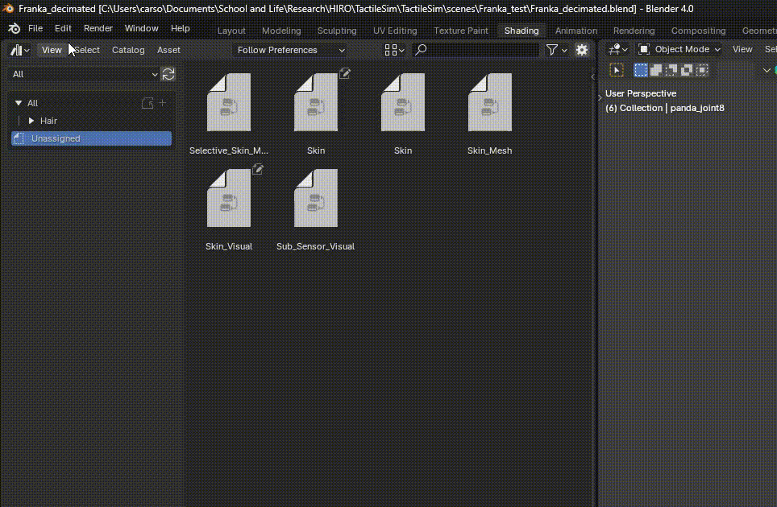
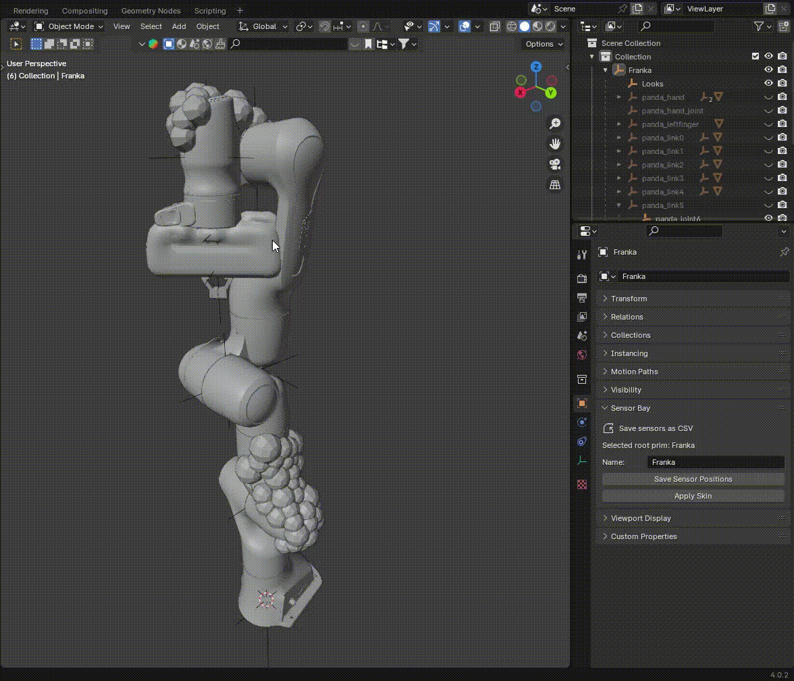
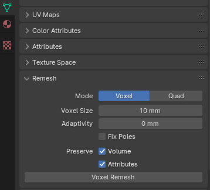
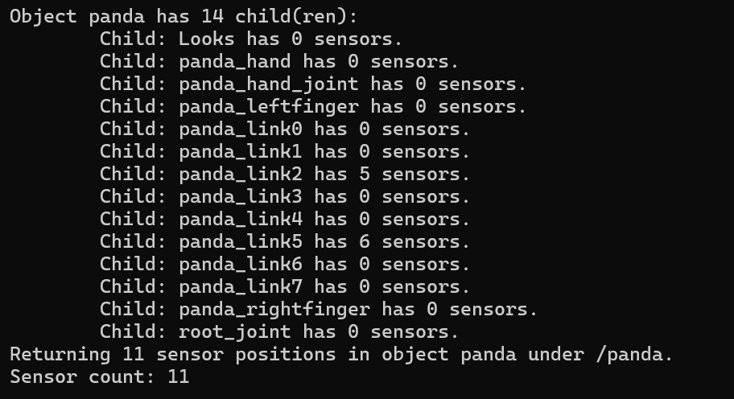

# Blender Tactile Sensor Bay Add-on
The blender tactile sensor bay addon is a tool made for procedurally generating variable density 3D printed tactile skins. This tool was designed to streamline the process of making large-scale coverage tactile sensor arrays.

# Installation
This addon was tested on Blender 4.1.1. Note, the way that geometry nodes are handled after Blender 4.1.1 has changed, restricting the skin from being imported to Isaac sim or saved as a csv file. 

# Importing the Add-on:

1) Either clone this repo or download **sensor_bay_addon.zip** under the *blender_scripts* folder.
2) Navigate to the Add-on window in Blender under *Edit > Preferences > Add-ons*
3) Click the *Install* button and navigate to the local save location of **sensor_bay_addon.zip**
4) In the search bar in the preferences window, search for **Tactile Sensor Bay** and enable the add-on. If the add-on does not show up, make sure the *Enabled Add-ons Only* button is not on.

# Dependancies:
If your version of blender does not include numpy or networkx, run this script in administrator mode through the scripting console in blender.
`import sys`
`import pip`
`pip.main(['install', 'numpy', '--target', (sys.exec_prefix) + '\\lib\\site-packages'])`
`pip.main(['install', 'networkx', '--target', (sys.exec_prefix) + '\\lib\\site-packages'])`

# Applying the Skin Geometry Node:
The skin geometry node is a custom node group that is used to apply the skin to the robot. It is located in the *Assets* folder of the addon.
You must have the *gemoetry_nodes.blend* file in your assets path in blender for the skin geometry node to be available. To add the skin geometry node to your asset path:
1) In preferences, navigate to the *File Paths* tab.
2) In the *Asset Libraries* section, click the plus sign to add a new asset library.
3) Set the path to the source code of this repository, specifically on the *sensor_bay_addon* folder. Ex: `/home/usr/GenTact/blender_scripts/sensor_bay_addon`
4) Now the *Skin* geometry node should be available in the *Asset Browser* under the *sensor_bay_addon* folder!

# Saving Configurations

The *Save Sensor Positions* button exports a .csv file contatining the sensor node positions as well as their respective path in the scene. Make sure the root primitive of the robot is selected before clicking the save button. This file is used to import the sensors designed in this environment to the Isaac Sim extension. [Click here](https://github.com/cKohl10/TactileSim/tree/main/exts) to learn more about how to use the [**Isaac Sim Contact Extension**](https://github.com/cKohl10/TactileSim/tree/main/exts) 

# Tips and Tricks
1) **Smooth Edges and Reduce Computation**: The skin modifier gets computationally expensive and has a more difficult time smoothing edges with high resolution models. If your robot file contains many vertices, it may be helpful to perform a **Voxel Remesh** on your robot. This can be done natively in Blender under *Data > Remesh > Voxel Remesh*. 
   
Make sure to adjust the the *Voxel Size* attribute to conserve important dimensions of your robot while also reducing the number of vertices.
 

2) **Debugging Save Errors**: If the save button in the add-on are not correctly identifying your sensors, there are a couple common problems you shoud check. You can see a full breakdown of what the save buttons are doing by opening Blender in a terminal. Here is an example output of the save button being used on a Franka arm with 11 sensors:  
   1) **Common Error: Incorrect Naming**: The save buttons sweep through all objects with a **Skin** geometry nodes modifier enabled. If your geometry node is not named *Skin* or a duplicate of it (i.e *Skin.001*), the save process will not find it.
   2) **Common Error: Incorrect Object Selected**: The save buttons sweep down all children of the selected object in the Blender scene for skin modifiers. Make sure the root object of the robot is selected. 
   3) **Common Error: Incorrect Sensor Positions**: If you need the output of sensor locations in world coordinates for printing, make sure the object origin is set to the world origin and all transforms have been applied.

# Alligator Save
The Alligator Save operator is used to output the full mesh for 3D printing with the alligator clip nodes. This will seperate the mesh into multiple files to be used for printing in multiple materials. A camera is used to render a preview, so you may run into an error if you don't have any cameras in your scene.
